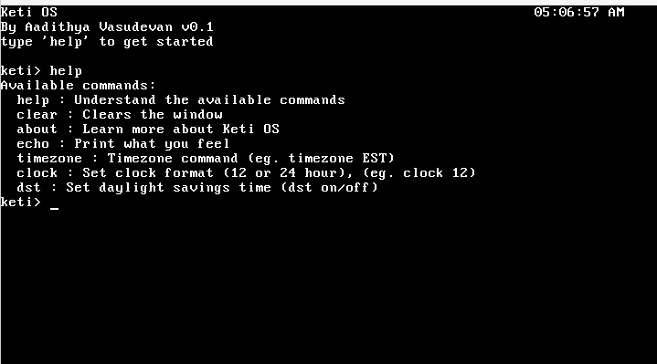

# Keti-OS

A 32-bit x86 operating system built from the ground up in C and assembly. Interactive shell, real-time clock, preemptive multitasking, and user mode - built to eventually run its own language, games, and a local AI model.




## What it does right now

- Boots via GRUB into 32-bit protected mode
- Interactive shell with command history (up / down arrows)
- Real-time clock in the corner with timezone and 12/24-hour support
- Scrollback - press **F11** to scroll up through history, **F12** to come back down
- Paging, a kernel heap (`kmalloc`/`kfree`), and a physical memory manager
- Preemptive multitasking with a round-robin scheduler
- System calls (`int 0x80`) and user mode (ring 3)

Type `help` once it boots to see available commands.

---

## Building from source

This is the primary path - most people reading this want to build on top of Keti OS, not just run it.

### Platform

Keti OS is built and tested on **WSL (Ubuntu)** on Windows and on plain **Linux**. These instructions cover both.

**Windows users:** do everything inside WSL. Install it with:
```
wsl --install
```
or just install it on VS Code in extensions.

The native Windows QEMU build doesn't work reliably - WSL is the right path and behaves exactly like Linux.

**macOS:** possible but more involved. You'd need to build an `i686-elf` cross-compiler from source or via Homebrew. The Linux/WSL path is smoother for getting started.

### 1. Install the toolchain

```bash
sudo apt update
sudo apt install build-essential nasm qemu-system-x86 \
                 grub-pc-bin grub-common xorriso \
                 gcc-i686-linux-gnu
```

What each package does:
- `gcc-i686-linux-gnu` - the 32-bit cross-compiler (`i686-linux-gnu-gcc`)
- `nasm` - assembler for the `.asm` files
- `qemu-system-x86` - runs the built ISO
- `grub-pc-bin`, `grub-common`, `xorriso` - needed by `grub-mkrescue` to build the bootable ISO
- `build-essential` - gives you `make` and the base C toolchain

### 2. Clone and build

```bash
git clone https://github.com/Aadithya-19/Keti-OS.git
cd Keti-OS
make
```

`make` builds the kernel, assembles all the `.asm` files, links everything, generates `build/keti.iso`, and launches QEMU automatically.

### 3. Other make targets

```bash
make run    # run the already-built ISO without rebuilding
make clean  # remove all build artifacts
```

---

## Controls

| Key            | Action                              |
|----------------|-------------------------------------|
| Up / Down      | Cycle through command history       |
| F11            | Scroll up through output history    |
| F12            | Scroll back down to live view       |
| Shift          | Uppercase and symbols               |
| Ctrl+Alt+F     | Toggle fullscreen in QEMU           |

---

## Project layout

```
boot/           assembly: bootloader, GDT/IDT loaders, ISRs, context switch, usermode
kernel/
  display/      VGA text driver with buffer-backed scrollback
  cpu/          GDT, IDT
  drivers/      keyboard, timer, RTC, ports
  memory/       physical memory manager, paging, kernel heap
  process/      PCB, round-robin scheduler, syscall interface
  shell/        interactive shell, command dispatch, history
  lib/          string utilities
docs/           screenshots, the OS dev checklist, and contributor logs
link.ld         linker script
Makefile        build and run
```

---

## Contributing

This is a pre-stable beta. The codebase is intentionally readable - every subsystem is small and self-contained.

You do **not** need to write any assembly to contribute. The assembly layer (interrupts, context switching, bootloader) is already done. Contributors work in C on top of it.

### Contribution tiers

**Easy - pure C, no kernel knowledge needed:**
- New shell commands (add one entry to `commands[]` in `kernel/shell/shell.c` and write the handler)
- Games and apps (after the ELF loader lands - write C, compile to `.elf`, Keti runs it)
- String utilities in `kernel/lib/`

**Medium - C with some kernel awareness:**
- New drivers (extending keyboard, RTC, adding new hardware)
- Shell improvements (tab completion, new parsing features)
- Filesystem implementation (the next big milestone)

**Hard - C + assembly, kernel internals:**
- New interrupt handlers
- Memory management changes
- Scheduler improvements

The shell (`kernel/shell/shell.c`) and the display driver (`kernel/display/vga.c`) are the best starting points for most contributors.

### Logging your contributions

Contributors are encouraged to add their logs to the `docs/` folder so others can understand what was built and how. Create a subfolder for what you worked on and add your notes there - for example, `docs/chess/` for a chess implementation, `docs/filesystem/` for filesystem work. Write whatever format works for you: dated entries, design notes, debugging stories. The goal is that someone reading it later can follow the thinking, not just the code.

Open an issue or a pull request. Things will change, break, and improve - that's the point.

---

## Roadmap

- Filesystem (VFS + ramdisk) and ELF loader so programs run as real files
- Auth/login screen
- Calculator and text editor
- Tetris and Chess
- Boot on real x86 hardware from USB
- Graphics mode (Mode 13h)
- Native Keti language with a built-in tutorial
- Local AI assistant - inference engine in C, no cloud dependency

---

One thing I want to highlight is, I will continuously add more stuff and this is my README, so I'll probably move this down as I add ways to personalize this for others, and how to do what I did. btw, if you are reading this and are feeling lost, dont worry. I was in your shoes (if you are size 13 UK) in June 14th 2026 (the day I started), and I asked Claude (cuz our brains are shrinking lol) for some resources to learn and it made an insanely good looking html page that you can run and use all the resources I used. I also asked for a checklist and this has the checklist html as well. Shoutout to NanoByte, Little OS Book, Claude(i know) and others. You guys are the GOATs!